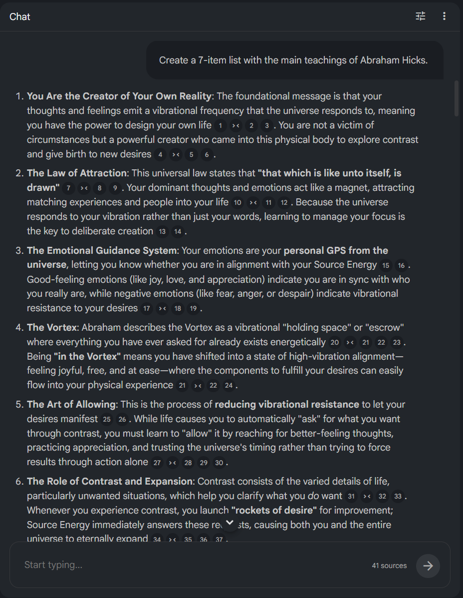
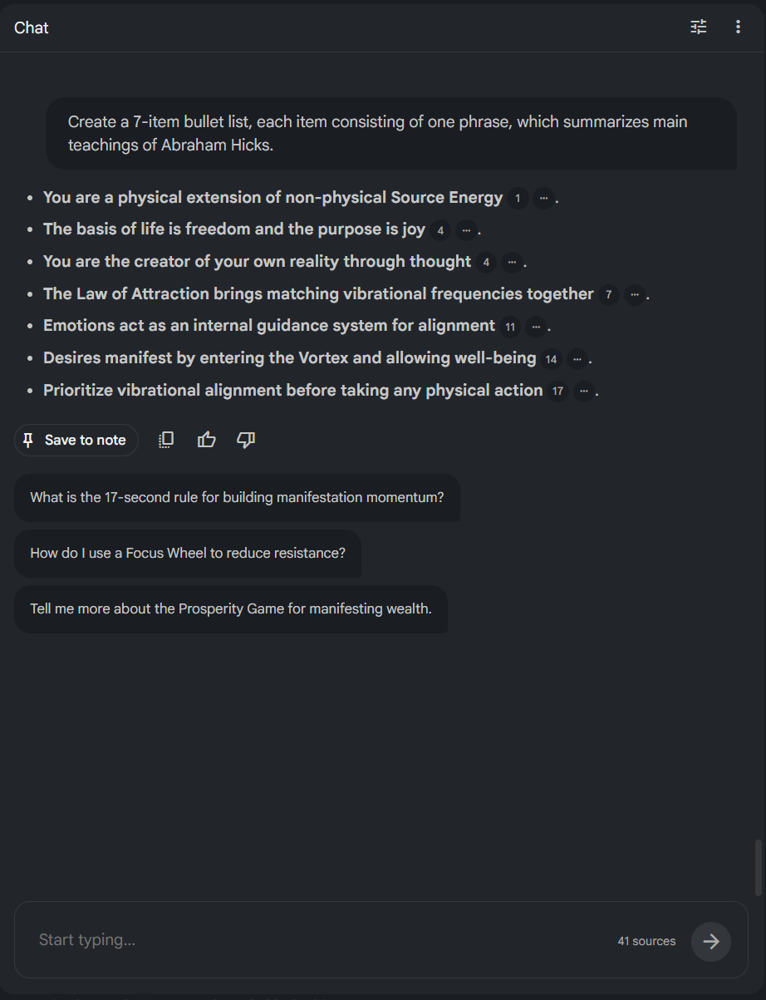

## 🧪 Prompt Engineering

##### Prompt 1:

Create a 7-item list with the main teachings of Abraham Hicks.

🎯 Object: To create an itemized list with 7 short sentences presenting the main concepts discussed on the sources.  
🫤 Unwanted result: Each item presented a longer explanation of the concept.

 ❌ Unwanted result

👩‍🔧 Prompt refinement: Added specifications for the length of the items and format of the list (bullet list instead of numbered list).

##### Prompt 2 (refined):

Create a 7-item bullet list, each item consisting of one phrase, which summarizes main teachings of Abraham Hicks.

✅ Wanted result achieved: A condensed 7-item bulleted list summarizing Abraham Hicks' main teachings.

